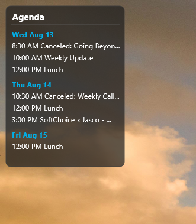

# Outlook Agenda - Rainmeter Skin

A Rainmeter skin that provides a quick overview of your upcoming Outlook calendar events directly on your desktop. Stay on top of your schedule without opening Outlook.

## Features

- **Automatic Updates**: Refreshes every 5 minutes to keep your schedule current
- **Manual Refresh**: Middle-click anywhere on the skin to force an immediate update
- **Interactive Elements**:
  - Click on any date header to open your Outlook calendar
  - Click on any event to open that specific event in Outlook
  - Hover over events to see duration and location details
- **Clean Display**: Shows upcoming events with times, organized by date
- **Customizable**: Adjustable number of days and events to display

## Requirements

This skin requires [Rainmeter](https://www.rainmeter.net/) to be installed on your system. You must also have Microsoft Outlook installed and configured with your calendar.

**Note**: This skin is designed for classic Outlook desktop app. The new Outlook for Microsoft 365 may have limited or no compatibility due to restricted COM automation support.

## Installation

1. Go to the [Releases](../../releases) page
2. Download the latest `.rmskin` file
3. Double-click the downloaded file to install
4. Rainmeter will automatically load and apply the skin

## Configuration

The skin can be customized by editing the variables in `Agenda.ini`:

- `DaysToShow`: Number of days ahead to display (default: 5)
- `MaxItems`: Maximum number of events to show (default: 30)
- `RefreshMinutes`: Auto-refresh interval in minutes (default: 5)
- `Width`: Skin width in pixels (default: 200)

## Troubleshooting

If events are not displaying:
- Ensure Outlook is installed and your calendar is accessible
- Try right-clicking the skin and selecting "Refresh" or "Force Update Now"
- Check that Outlook is not blocking COM access

## License

MIT License - feel free to modify and distribute.
